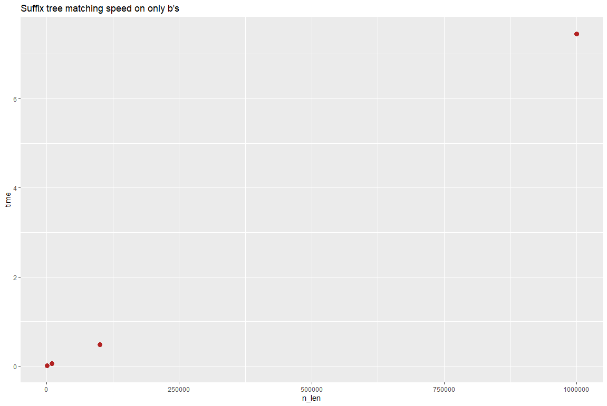
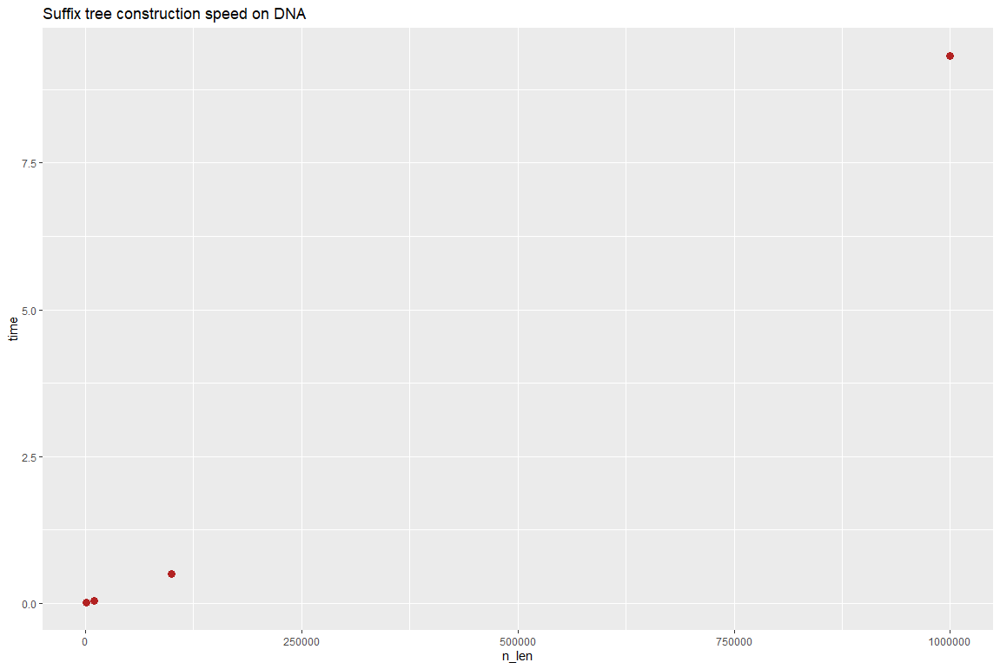
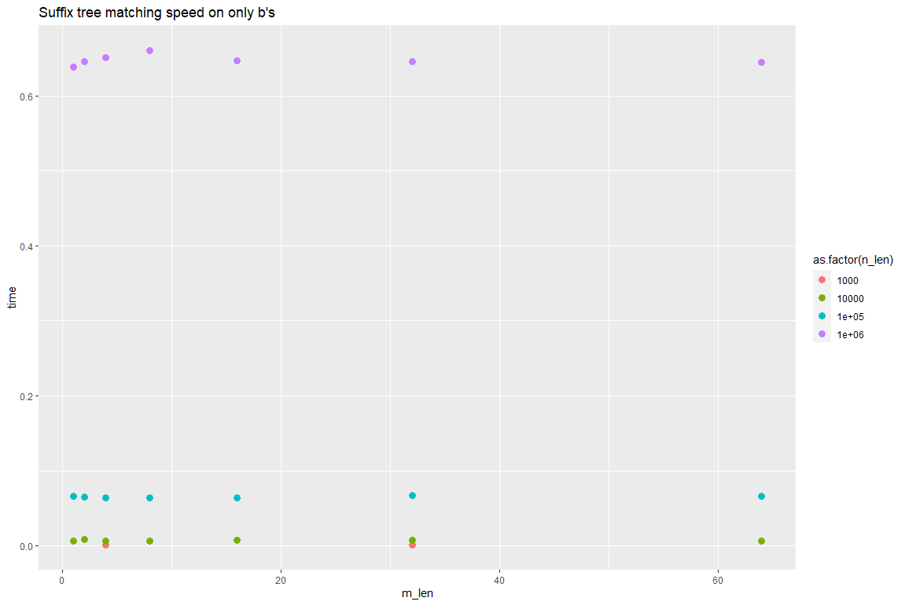
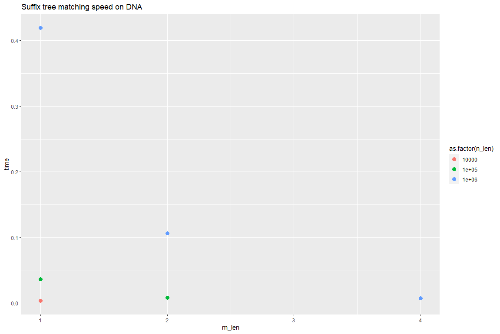

# Project 2: Suffix tree construction

You should implement a suffix tree construction algorithm. You can choose to implement the naive O(n²)-time construction algorithm as discussed in class or McCreight’s O(n) construction algorithm. After that, implement a search algorithm (similar to slow-scan) for finding all occurrences of a pattern. This algorithm should run in O(m+z) where m is the length of the pattern and z the number of occurrences.

Write a program, `st` using the suffix tree exact pattern search algorithm (similar to slow-scan) to report all indices in a string where a given pattern occurs. 

The program should take the same options as in project 1: `st genome.fa reads.fq`. The program should output (almost) the same SAM file. Because a search in a suffix tree is not done from the start to the end of the string the output might be in a different order, but if you sort the output from the previous project and for this program, they should be identical.

## Evaluation

Implement the tool `st` that does exact pattern matching using a suffix tree. Test it to the best of your abilities, and then fill out the report below.

# Report

## Specify if you have used a linear time or quadratic time algorithm.
Linear

## Insights you may have had while implementing and comparing the algorithms.
That suffix trees allow us to find all patterns in a string by isolating the subtree for which all leafs are suffixes of the string suffixes, so that pattern + subtree suffix equals all suffixes of the string that includes the pattern as a prefix.

## Problems encountered if any.
Many.

## Correctness
I've run suffix tree construction on many types of strings, including the two analyzed in https://www.youtube.com/watch?v=aPRqocoBsFQ. These trees ive confirmed looked exactly like the ones in the video. I've also made two function for extracting and printing all the suffixes from shortest to longest from the leaf nodes (by first getting the suffixes and then sorting them, nothing fancy).
*Describe experiments that verifies the correctness of your implementations.*

## Running time

I ran my suffix tree construction algorithm and my suffix tree match algorithm for several string of either DNA vocabulary (ACTG) or all b's.
As can be seen on the graphs, the all b's match algorithm has a constant high amount of running time, as there are a lot of matches to output, while the DNA actually decreases the longer the pattern gets, as there should be substantially fewer matches for a longer string (in fact, as the string is random, on average, the amount of matches should be quartered for each extension of m).
For the construction algorithm no real difference is seen between the two types of data, but it is clear that the data increases linearly with the size of the string, as we expected, and that is just great.
